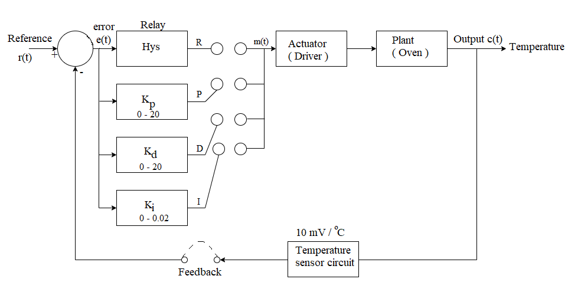

## Introduction

<b>Discipline | <b> Electrical Engineering 
:--|:--|
<b> Lab | <b> **Control and Instrumentation Lab**
<b> Experiment|     <b> **Temperature Control system and Experiment 4**

### About the Experiment 
**System description**
 
					Temperature control is one of the most common industrial control systems that are in operation. This equipment is designed to expose the students to the 
					intricacies of such a system in the 'friendly' environment of a laboratory,free from disturbances and uncertainties of plant prevalent in an actual process.
					The plant to be controlled is a specialy designed oven having a short heating and cooling time.A solid state temperature sensor converts the absolute temperature information
					to a proportional electrical signal. The reference and actual temperatures are indicated in degree Celsius on a switch selectable digital display.
					 
					The controller unit compares the reference and the measured signals to generate the error.
			      

                   
                   
 

<b>Name of Developer | <b> **Prof. Alok Kanti Deb**
:--|:--|
<b> Institute | <b>  **Indian Institute of Technology Kharagpur**
<b> Email id|     <b>  **alokkanti@ee.iitkgp.ac.in**
<b> Department |  **Department of Electrical Engineering**
<b>Webpage| <b> http://www.iitkgp.ac.in/department/EE/faculty/ee-alokkanti

### Contributors List

SrNo | Name | VLabs Developer or Integration Engineer | Designation | Department| Institute
:--|:--|:--|:--|:--|:--|
1 | **Piyali Chattopadhyay** | Developer & Integration | Project Scientist | Department of Electrical Engineering | IIT Kharagpur | 
