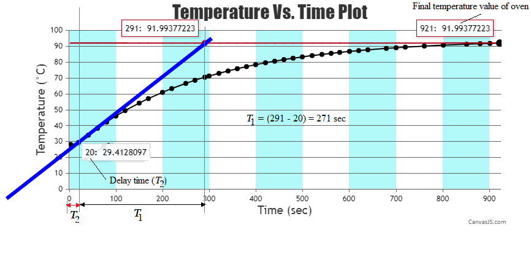

### Procedure

<b>Fig 1: Block diagram of the Temperature Controller</b>

<b>Fig 2: Circuit diagram of experimental setup for Temperature Control System simulation</b>

**Steps to perform the simulation**

1. Enter your room temperature (&deg;C) in corresponding box under the oven. First open loop control needs to be done on the plant (oven) for system identification and finding out plant open loop transfer function. Hence
  connect 1-5 (blue connecting dots) and click on the 'Check Connection' button.

2. Click on 'ON' button to switch on the unit (plant) and set the reference temperature to 5&#8451; by rotating the knob beside 'S2'  switch.

3. Set P potentiometer to 0.5 which gives kp = 10 and input of 5 V to the driver .

4. Put switch 'S2 to 'MEASURE' position and 'S1 to 'RUN', click on 'Start' button of the stop watch. 

5. Click on 'Table' button to observe the room temperature , now take observation by clicking 'Table' button after each 10 sec. until the plant temperature becomes stable (two to three temperature values in observation table will be approximately same).

6. Click on 'Stop' to stop the stop watch.

7. Click on 'Plot' button to observe temperature (&deg;C) vs. time (sec) curve for open loop control. Click on 'Calculation'.

8. Calculate dc gain (k) of the plant transfer function using the formula
 
$$\frac{(\ Oven \ final \ temperature \ - \ Entered \ room \ temperature)}{(Reference \ (set) \ temperature \times \ Proportional \ gain \ (ex: \ 0.5 \times \ 20 \ = \ 10)) \times 0.01 \ (\ as \ sensor \ gain \ is \ 10 \ mV/\degree C)}$$

Enter dc gain value to corresponding box in 'Result block'.

9. Align the slope line (blue coloured line) with a linear segment of the open loop plot with the help of 'Adjust slope angle', 'Adjust slope length', 'Horizontal movement' and 'Vertical movement' buttons.

 10. Click on clockwise arrow symbol on 'Adjust slope angle' button to rotate the slope line in clockwise direction.

Click on counter-clockwise arrow symbol on 'Adjust slope angle' button to rotate the slope line in anti clockwise direction.

Click on plus symbol on 'Adjust slope length' button to increase the length of the slope line.
Click on minus symbol on 'Adjust slope length' button to decrease the length of the slope line.

Click on the arrow symbol in the left side on 'Horizontal movement' button to move the slope line to the right.
Click on the arrow symbol in the right side on 'Horizontal movement' button to move the slope line to the left.

Click on the arrow symbol in the left side on 'Vertical movement' button to move the slope line to the upwards direction.
Click on the arrow symbol in the right side on 'Vertical movement' button to move the slope line to the downwards direction.							

<b>Fig 3: Calculation of time constant (T1) and delay time (T2)</b>

11. To get the time constant (T1) and delay time (T2) observe the intersection points of slope line with the 
horizontal red line (drawn from final temperature value) and x-axis as shown in fig 3. Enter those values in
corresponding boxes under 'Result block' and click on 'Submit' button to get the plant transfer function. Plot can be downloaded by clicking on 'Download' button.

12. Click on 'Clear' button and reset the stop watch. Switch off the unit. Wait untill the oven temperature reaches the room temperature.

13. Switch on the unit. Set the reference temperature to 60&#8451; now. Set P potentiometer to 0.7. Connect 1-5, 8-9 for proportional control and click on the 'Check Connection' button.
 Follow the steps 4 to 7 to observe temperature (&deg;C) vs. time (sec) curve for proportional control. After plotting click on 'Calculation' to  calculate corresponding results (&percnt; steady state error and &percnt; overshoot) under 'Result block'. Click on 'Clear' button and reset the stop watch. Switch off the unit. Wait untill the oven temperature reaches the room temperature.
 

14. Switch on the unit. Set P potentiometer to 0.6 and I potentiometer to 0.8 now. Connect 1-5, 8-9, 2-6 for proportional integral control and click on the 'Check Connection' button.
 Follow the steps 4 to 7 to observe temperature (&deg;C) vs. time (sec) curve for proportional integral control. After plotting click on 'Calculation' to 
 calculate corresponding results (&percnt; steady state error and &percnt; overshoot) under 'Result block'.

 
15. Switch on the unit. Similarly, set P potentiometer to 0.8, I potentiometer to 1.0 and D potentiometer to 0.3 now. Connect 1-5, 8-9, 2-6, 3-7 for proportional integral derivative control and click on the 'Check Connection' button.
 Follow the steps 4 to 7 to observe temperature (&deg;C) vs. time (sec) curve for proportional integral derivative control. After plotting click on 'Calculation' to 
 calculate corresponding results (&percnt; steady state error and &percnt; overshoot) under 'Result block'.
 Click on 'Clear' button and reset the stop watch. Switch off the unit. Bring back all the knobs to zero value.
  
<link href="./simulation/css/TC.css" rel="stylesheet">

  