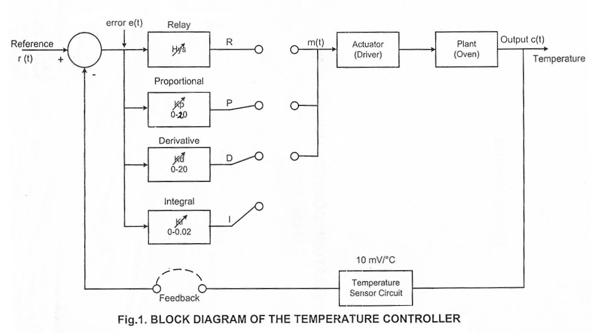
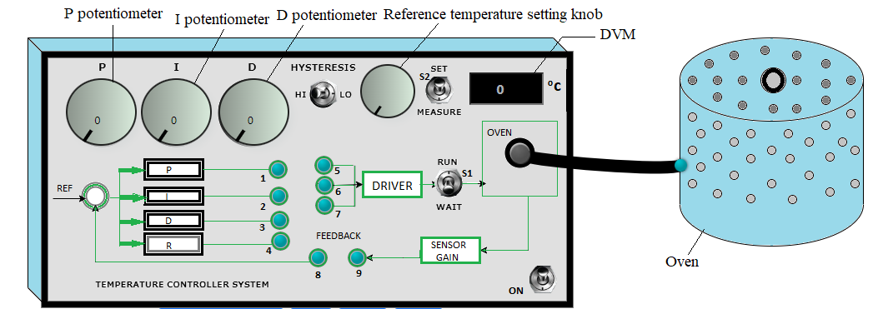

### Procedure

**Set up in Lab:**

            

            

								
[Fig 2: Circuit diagram of experimental set-up for Temperature Control system simulation]

**Steps to perform the simuation**

1. At first Open loop Control needs to be done on the plant(Oven)for system identification and finding out plant open loop transfer function.Henceconnect 1-5(blue connecting dots) and click on the 'Check Connection' button.
 
2. Click on 'ON' button to switch on the circuit and set the reference temperature to 5&#8451; (default) by clicking on plus sign of the knob beside 'measure'button.
									 
3. Set P potentiometer to 0.5 which gives kp=10 and input of 5v to the driver .

4. Put switch 'S2 to 'measure' position and 'S1 to 'Run',click on'Start' button of the stop watch.

5. Click on 'Table' button to observe the room temperature ,now take observation by clicking 'Table' button after each 10 sec. until the plant temperature becomes stable(two to three temperature value in observation table will come approximately same).
										
6. Click on 'Stop' to stop the stop watch.

7. Click on 'Plot' button to observe Temperature Vs. Time curve for open loop control.Click on 'Ok' to see plant Transfer Function.Plot can be downloaded by clicking on 'Download Plot' button.

8. Click on 'clear' and reset the stop watch.Set the reference temperature to 60&#8451; now.

9. Set P potentiometer to 0.6 now.Connect 1-5,8-9 for Proportional Control and click on the 'Check Connection' button.Follow the steps 4 to 8 to observe Temperature Vs. Time curve for Proportional control.After plotting click on 'Ok' to calculate corresponding results(steady state error and Percentage Overshoot).
									 
10. Set P potentiometer to 0.6 and I potentiometer to 0.8 now.Connect 1-5,8-9,2-6 for Proportional Integral Control and click on the 'Check Connection' button.Follow the steps 4 to 8 to observe Temperature Vs. Time curve for Proportional Integral control.After plotting click on 'Ok' to calculate corresponding results(steady state error and Percentage Overshoot).
										 
11. Similarly, set P potentiometer to 0.8, I potentiometer to 1.0 and D potentiometer to 0.3 now.Connect 1-5,8-9,2-6,3-7 for Proportional Integral Derivative Control and click on the 'Check Connection' button.Follow the steps 4 to 8 to observe Temperature Vs. Time curve for Proportional Integral Derivative control.After plotting click on 'Ok' to calculate corresponding results(steady state error and Percentage Overshoot).
 
  