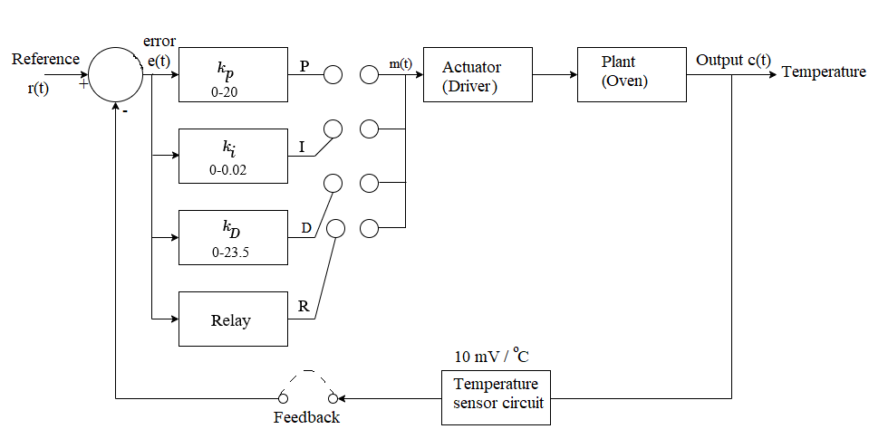
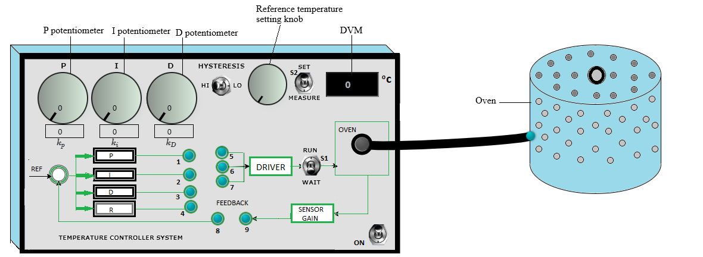
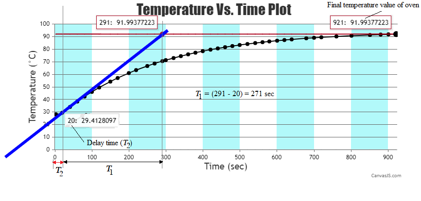

### Procedure

  
<b>Fig. 1. Block diagram of the Temperature Controller</b>

 

 
<b>Fig. 2. Circuit diagram of experimental setup for Temperature Control System simulation</b>

 

 

<b>Steps to perform the simulation</b> 
<ol type="1">
<li><ul><li>Enter your room temperature (&deg;C) in corresponding box under the oven.</li>
<li>First open loop control needs to be done on the plant (oven) for system identification and finding out plant open loop transfer function.</li>
<li>Hence connect 1-5 (blue connecting dots) (Fig. 2) and click on the 'Check Connection' button on simulation page.</li>
<li><b>Note:</b> Example: connection point 1 - connection point 2 (drag the wire from connection point 1 by pressing left mouse button and release on connection point 2).</li>
<li><b>Note:</b> Any wire connection can be deleted by clicking on the connected wire if required.</li>
</ul></li> 

<li><ul><li>Click on 'ON' button to switch on the unit (plant) and set the reference temperature to 5&#8451; by rotating the knob beside 'S2' switch.</li>
<li><b>Note:</b> To rotate any knob put the mouse cursor on the knob handle (black line on the knob), a hand symbol will be showing. Press left mouse button, rotate clockwise to increase or anticlockwise to decrease values.</li>
<li><b>Note:</b> If the desired value does not appear while rotating the knob in one attempt, try rotating it back and forth to reach the correct value.</li>
</ul></li> 

<li> Set P potentiometer to 0.5 which gives kp = 10 and input of 0.5 V to the driver .</li> 

<li>Put switch 'S2 to 'MEASURE' position and 'S1 to 'RUN', click on 'Start' button of the stop watch.</li>  

<li><ul><li>Click on 'Table' button to observe the room temperature</li>
<li>Now take observation by clicking 'Table' button after each 10 sec. until the
plant temperature becomes stable (two to three temperature values in observation table will be approximately same).</li></ul></li> 

<li>Click on 'Stop' to stop the stop watch.</li><br//>

<li>Click on 'Plot' button to observe temperature (&deg;C) vs. time (sec) curve for open loop control. Click on 'Calculation'.</li> 

<li>Calculate dc gain (k) of the plant transfer function using the formula

$$\frac{(\ Oven \ final \ temperature \ - \ Entered \ room \ temperature)}{(Reference \ (set) \ temperature (ex: \ 5^\circ \ C) \times \ Proportional \ gain \ (ex: \ 0.5 \times \ 20 \ = \ 10)) \times 0.01 \ (\ as \ sensor \ gain \ is \ 10 \ mV/&deg;C)}$$

Enter dc gain value to corresponding box in 'Result block'.</li> 

<li> Align the slope line (blue coloured line) with a linear segment of the open loop plot with the help of 'Adjust slope angle', 'Adjust slope length', 'Horizontal movement' and 'Vertical movement' buttons.</li> 

<li><ul><li>Click on clockwise arrow symbol on 'Adjust slope angle' button to rotate the slope line in clockwise direction.</li>
<li>Click on counter-clockwise arrow symbol on 'Adjust slope angle' button to rotate the slope line in anti clockwise direction.</li>

<li>Click on plus symbol on 'Adjust slope length' button to increase the length of the slope line.</li>
<li>Click on minus symbol on 'Adjust slope length' button to decrease the length of the slope line.</li>

<li>Click on the arrow symbol in the left side on 'Horizontal movement' button to move the slope line to the right.</li>
<li>Click on the arrow symbol in the right side on 'Horizontal movement' button to move the slope line to the left.</li>

<li>Click on the arrow symbol in the left side on 'Vertical movement' button to move the slope line to the upwards direction.</li>
<li>Click on the arrow symbol in the right side on 'Vertical movement' button to move the slope line to the downwards direction.</li>							

</li></ul></li> 

 
<b>Fig. 3. Calculation of time constant (T1) and delay time (T2)</b>

 

<li><ul><li>To get the time constant (T1) and delay time (T2) observe the intersection points of slope line with the 
horizontal red line (drawn from final temperature value) and x-axis as shown in Fig. 3.</li>
<li>Enter those values in corresponding boxes under 'Result block' and click on 'Submit' button to get the plant transfer function.</li>
<li>Plot can be downloaded by clicking on 'Download' button.</li></ul></li> 

<li>Click on 'Clear' button and reset the stop watch. Put switch 'S2 to 'SET' position and 'S1 to 'WAIT' and switch off the unit. Wait untill the oven temperature reaches the room temperature.</li> 

<li><ul>
<li>Connect 1-5, 8-9 (Fig. 2) for proportional control and click on the 'Check Connection' button.</li>
<li>Switch on the unit. Put 'S2' to 'SET', set the reference temperature to 60&#8451; now.</li>
<li>Set P potentiometer to the <i>kp</i> value calculated using the Ziegler-Nichol rule following the instructions given in theory (&approx;0.7).</li>

<li>Follow the steps 4 to 7 to observe temperature (&deg;C) vs. time (sec) curve for proportional control.</li>
<li>After plotting click on 'Calculation' to calculate corresponding results (&percnt; steady state error and &percnt; overshoot) under 'Result block'.</li>
<li>Click on 'Clear' button and reset the stop watch. Put switch 'S1' to 'WAIT' and switch off the unit. Wait untill the oven temperature reaches the room temperature.</li></ul>
</li> 

<li><ul>
<li>Connect 1-5, 2-6, 8-9 (Fig. 2) for proportional integral control and click on the 'Check Connection' button.</li>
<li>Switch on the unit. Put 'S2' to 'SET', set the reference temperature to 60&#8451;</li>
<li>Set P potentiometer to the <i>kp</i> value (&approx;0.6) and I potentiometer to the
<i>ki</i> value (&approx;0.8) calculated using the
Ziegler-Nichol rule following the instructions given in theory now.</li>

<li>Follow the steps 4 to 7 to observe temperature (&deg;C) vs. time (sec) curve for proportional integral control.</li>
<li>After plotting click on 'Calculation' to calculate corresponding results (&percnt; steady state error and &percnt; overshoot) under 'Result block'.</li>
<li>Click on 'Clear' button and reset the stop watch. Put switch 'S1' to 'WAIT' and switch off the unit. Wait untill the oven temperature reaches the room temperature.</li></ul></li> 

<li><ul>
<li>Connect 1-5, 2-6, 3-7, 8-9 (Fig. 2) for proportional integral derivative control and click on the 'Check Connection' button.</li>
<li>Switch on the unit. Put 'S2' to 'SET', set the reference temperature to 60&#8451;</li>
<li>Similarly, set P potentiometer to the <i>kp</i> value (&approx;0.8), I potentiometer to
the <i>ki</i> value (&approx;1.0) and D potentiometer to the
<i>kD</i> value (&approx;0.3) calculated using the
Ziegler-Nichol rule following the instructions given in theory now.</li>

<li>Follow the steps 4 to 7 to observe temperature (&deg;C) vs. time (sec) curve for proportional integral derivative control.</li>
<li>After plotting click on 'Calculation' to calculate corresponding results (&percnt; steady state error and &percnt; overshoot) under 'Result block'.</li>
<li>Click on 'Clear' button and reset the stop watch. Put switch 'S1' to 'WAIT' and switch off the unit. Bring back all the knobs to zero value.  Wait untill the oven temperature reaches the room temperature.</li></ul></li> 

<li><ul>
<li>Connect 4-7, 8-9 for ON-OFF control, click on the hysteresis switch to keep it to 'LO' and click on the 'Check Connection' button.</li>
<li>Switch on the unit. Put 'S2' to 'SET', set the reference temperature to 60&#8451;</li></ul></li> 

<li>Put switch 'S2 to 'MEASURE' position and 'S1 to 'RUN', click on 'Start' button of the stop watch.</li>  

<li><ul><li>Click on 'Table' button to observe the room temperature.</li>
<li>Now take observation by clicking 'Table' button after each 10 sec. upto 20 minutes (1200 sec).</li></ul></li> 

<li>Click on 'Stop' to stop the stop watch.</li> 

<li>Click on 'Plot' button to observe temperature (&deg;C) vs. time (sec) curve for ON-OFF control.</li> 

<li>Click on 'Clear' button and reset the stop watch. Put switch 'S1 to 'WAIT' and switch off the unit. Wait untill the oven temperature reaches the room temperature.</li> 
<li>Connect 4-7, 8-9, set the hysteresis switch to 'HI' now and click on the 'Check Connection' button.</li> 
<li>Repeat steps 16-21.</li>
<li>Click on 'Compare Plots' button on simulation page to compare the closed loop system responses due to all the controllers.</li>

</ol>	

<link href="./simulation/css/TC.css" rel="stylesheet">

  
