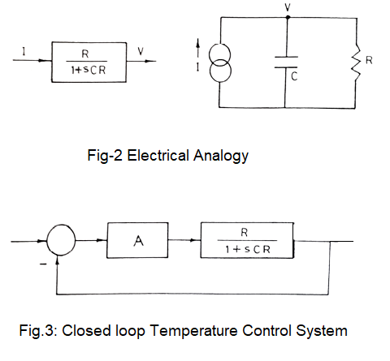
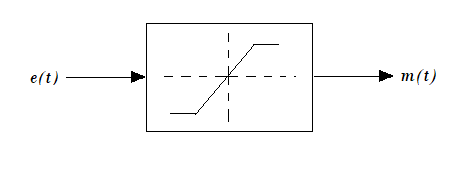
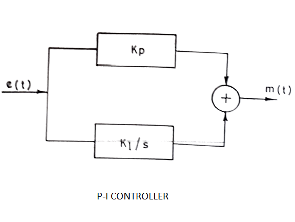

# Theory

 The first step in the analysis of control system is to derive its mathematical model of the complete system. This would help in understanding the working of the complete system.

**The Plant(Oven)**

Plant to be controlled is an electric oven,the temperature of which must adjust itself in accordance with the reference or command.This is a thermal system which basically involves transfer of heat from one section to another.In present case we are interested in transfer of heat from heater coil to the oven and leakage of heat from the oven to the atmosphere.Here a lumped parameter model is considered.For precise analysis,a distributed parameter model must be used.Another difficulty associated with temperature control system is that 
whereas the temperature rise is produced by energy input,which is controllable,the temperature fall is due to heat loss, which is uncontrollable.There are three modes of heat transfer viz. conduction,convection,radiation.Heat transfer through radiation may be neglected in the present case since the temperatures involved are quite small. For conductive and convective heat transfer.

				

$${\Theta = \alpha \Delta T}$$
where, $${\Theta}= rate\ of\ heat\ flow\ in\ Joule/sec.$$
$${\Delta}  = temperature\ difference\ in  ^\circ C$$
$$ {\alpha} = constant $$

Under assumption of linearity,the themal resistance is defined as, R=Temperature difference/rate of heat flow

$$=\frac{\Delta T}{\Theta} = \frac{1}{\alpha}$$.

This is analogous to electrical resistance defined by I=V/R. In a similar manner thermal capacitance of the mass is defined by

$$\Theta = Cd \frac{\Delta T}{dT}$$

which is analogous to the V-I relationship ofa capacitor, namely I = C dV/dt. In the case of heat,
C = Rate of heat flow/Rate of temperature change.The equation of an oven may now be wHtten by combining the above two equations, implying that a part of the heat input is used in increasing the temperature of the oven and the rest zoes out as loss. Thus

$$\Theta = C dT/dt + (l/R)T,$$

with the initial condition T(t=0) = Tamb. Now, taking Laplace transform with zero initial condition,

$$\frac{T(s)}{\Theta(s)} = \frac{R}{1+sCR}$$

An analogous electrical network and block diagram may be drawn as in defined by the equation I=CdV/dt+V/R
The temperature rise in response to the heat input is not instantaneous. A certain amount
Of time is needed to transfer the heat by convection and conduction inside the oven. This requires a delay or transportation lag term, exp(-sTl), to be included in the transfer function, where Tl is the time lag in seconds.The open loop transfer function of the plant is given by :

$$G(s)= \frac{ke^{-sT_2}}{1+sT_1}$$

where k = DC gain of the system, T1=Time Constant ,T2=Delay Time

**Controller**
Basic control actions commonly used in temperature control systems are,
1)Proportional
2)Proportional-Integral
3)Proportional-Integral-Derivative
These are described below in some detail

**Proportional Controller:**
Proportional Controller is simply an amplifier of gain kp which amplifies the error signal and passes it to the actuator.The noise,drift and bias currents of this amplifier set the lower limit of the input signal which may be handled reliably and therefore decide the minimum possible value of the error between the input signal and output.A typical proportional controller may have input output characteristics as shown below
such controller gives non-zero steady state error to step input for a type-0 system. The proportional block(P) in the system consists of a variable gainn amplifier having a maximum value,Kp max of 20.

				

			   
**Proportional-Integral Controller:**

Mathematical equation of such a controller is given by,

$$m(t)= k_{p} e(t)+ k_i \int_{0}^{t}e(t)dt = K_p[e(t)+\frac{1}{T_1}\int_{0}^{t}e(t)dt]$$

It may be easily seen that this controller introduces a pole to origin,i.e. increases the system type by unity.The steady state error therefore reduced.a block diagram representation is shown below.Qualitatively,any small error signal e(t),present in the system,would get continuously integrated and generate actuator signal m(t)forcing the plant output to exactly correspond to the reference input so that error is zero. In practical system the error may not be zero due to imperfections in an electronic integrator caused by biased current needed,noise and drift present and leakage of the integrator capacitor.The integral(I)block in the present system is realised with a circuit,that has a transfer function :

$$G_{r}(s)=\frac{1}{41s}=\frac{K_{i}}{s}$$
The integral gain is therefore adjustable in the range 0 to 0.024 (approx).Due to the tolerance of large capacitance's the value of ki is approximate.   
			   

				

			   

				

 
			   
**Proportional-Integral-Derivative Controller:**
The governing equation here is,
$$m(t)= k_{p} e(t)+ k_i \int_{0}^{t}e(t)dt + K_D\frac{de(t)}{dt} = K_p[e(t)+\frac{1}{T_1}\int_{0}^{t}e(t)dt + T_D\frac{de(t)}{dt}]$$
so that in Laplace transform domain,
$$\frac{M(s)}{E(s)}=(k_p +T_D s+\frac{1}{T_1 s})$$
			   
A simple analysis would show that the derivative block essentially increases the damping ratio of the system and therefore improves the dynamic performance
by reducing overshoot.The PID controller therefore helps in reducing the steady state error with an improvement in the transient response.The Derivative(D)block in the present system is realised with a circuit,that has a transfer function :

$$G_{D}(s)=19.97s(approx)$$

The derivative gain is therefore adjustable in the range of 0 to 23.5 approximately.Again the approximation is Due to the tolerance of large capacitance's the value.PID controller is one of tthe most widely used controller because of its simplicity. By adjusting its coefficients kp,ki,kD
the controller can be used in variety of systems.The process of setting the controller coefficients to suit a given plant is known as tuning.There are many methods of tuning a PID controller. In present experiment, the method of Ziegler-Nichol has been introduced which is suitable for the oven control system.
According to the above said rule,
in P control,

$$k_p = (\frac{1}{K})\frac{T_1}{T_2}$$
in PI control, 
$$k_p = (\frac{0.9}{K})\frac{T_1}{T_2}$$ 
$$k_i = \frac{1}{3.3T_2}$$
				
in PID control,

$$k_p = (\frac{1.2}{K})\frac{T_1}{T_2}$$ 
$$k_i = \frac{1}{2T_2}$$
$$k_D = 0.5T_2$$
				

				

						
								